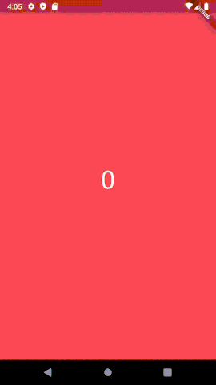

[](https://codecov.io/gh/dmt195/tiktok-flutter-plugin)


# tiktoklikescroller

A vertical fullscreen scroll implementation that snaps in place, similar to the TikTok app.

## Demo



## Usage

```dart
import 'package:flutter/material.dart';
import 'package:tiktoklikescroller/tiktoklikescroller.dart';

void main() => runApp(MyApp());

class MyApp extends StatelessWidget {
  @override
  Widget build(BuildContext context) {
    final List<Color> colors = <Color>[Colors.red, Colors.blue, Colors.green];
    final Controller controller = Controller()
      ...addListener((event) {
        _handleCallbackEvent(event.direction, event.success);
      });

    return MaterialApp(
      home: Scaffold(
        body: TikTokStyleFullPageScroller(
          contentSize: colors.length,
          swipePositionThreshold: 0.2,
          // ^ the fraction of the screen needed to scroll
          swipeVelocityThreshold: 2000,
          // ^ the velocity threshold for smaller scrolls
          animationDuration: const Duration(milliseconds: 400),
          // ^ how long the animation will take
          controller: controller,
          // ^ registering our own function to listen to page changes
          builder: (BuildContext context, int index) {
            return Container(
                color: colors[index],
                child: Text(
                  '$index',
                  style: const TextStyle(fontSize: 48, color: Colors.white),
                ),
              );
          },
        ),
      ),
    );
  }

  void _handleCallbackEvent(ScrollDirection direction, ScrollSuccess success,
      {int? currentIndex}) {
    print(
        "Scroll callback received with data: {direction: $direction, success: $success and index: ${currentIndex ?? 'not given'}}");
  }

}
```
